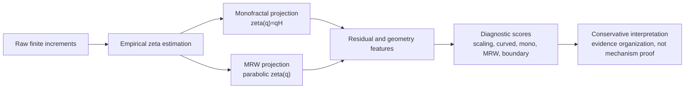

# Fig.1 Pipeline Mermaid

```mermaid
flowchart LR
  A["Raw finite increments"] --> B["Empirical zeta estimation"]
  B --> C["Monofractal projection<br/>zeta(q)=qH"]
  B --> D["MRW projection<br/>parabolic zeta(q)"]
  C --> E["Residual and geometry features"]
  D --> E
  E --> F["Diagnostic scores<br/>scaling, curved, mono, MRW, boundary"]
  F --> G["Conservative interpretation<br/>evidence organization, not mechanism proof"]
```